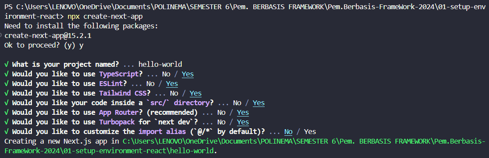

# SILFI NAZARINA / TI-3B / 2241720054 (21)

### **PRAKTIKUM 1 - Menyiapkan Lingkungan Pengembangan** 

Melakukan instalasi tools yang diperlukan untuk praktikum

**PERTANYAAN - PRAKTIKUM 1**

1. Jelaskan kegunaan masing-masing dari Git, VS Code dan NodeJS yang telah Anda install pada sesi praktikum ini! 

    Jawab: 
    
    - **Git** berfungsi sebagai version control system, membantu dalam pengelolaan kode, kolaborasi tim, dan penyimpanan proyek di platform seperti GitHub.

    - **VS Code** digunakan sebagai editor kode dengan fitur debugging, integrasi Git, dan dukungan berbagai bahasa pemrograman.

    - **Node.js** memungkinkan JavaScript berjalan di luar browser, digunakan untuk pengembangan backend dan mengelola package dengan npm.

2. Buktikan dengan screenshoot yang menunjukkan bahwa masing-masing tools tersebut telah berhasil terinstall di perangkat Anda!

     

### **PRAKTIKUM 2 -  Membuat Proyek Pertama React Menggunakan Next.js**

1. Membuat folder proyek baru dengan nama belajar-react. kemudian membuat proyek baru melalui cmd.

    

2. Buka folder proyek hello-world menggunakan VS Code.

    

3. Running proyek hello-world menggunakan perintah *npm run dev*

    
    

**PERTANYAAN - PRAKTIKUM 2**

1. Pada Langkah ke-2, setelah membuat proyek baru menggunakan Next.js, terdapat beberapa istilah yang muncul. Jelaskan istilah tersebut, TypeScript, ESLint, Tailwind CSS, App Router, Import alias, App router, dan Turbopack! 

    Jawab:

    - **TypeScript** : Bahasa pemrograman yang dikembangkan oleh Microsoft, yang merupakan versi lebih canggih dari JavaScript.Bedanya dengan JavaScript, TypeScript menambahkan tipe data (seperti string, number, boolean) agar kode lebih terstruktur dan aman juga bisa mendeteksi kesalahan sejak awal (sebelum kode dijalankan).
    - **ESLint**     : Alat yang membantu mendeteksi dan memperbaiki kesalahan coding agar lebih rapi dan sesuai standar.
    - **Tailwind CSS** : Framework CSS yang memungkinkan styling langsung di HTML dengan kelas-kelas siap pakai tanpa menulis banyak file CSS.
    - **App Router** : Sistem baru di Next.js yang lebih fleksibel untuk mengatur halaman dan layout aplikasi.
    - **Import Alias** : Memudahkan pemanggilan file tanpa perlu menulis path yang panjang.
    - **Turbopack**  : Alat baru yang membuat proses build dan reload Next.js lebih cepat.

2. Apa saja kegunaan folder dan file yang ada pada struktur proyek React yang tampil pada gambar pada tahap percobaan ke-3! 

    Jawab:

    **Folder:**
    - **.next/** : Folder yang dibuat secara otomatis saat proyek dijalankan, berisi file build dan cache.
    - **node_modules/** : Folder tempat menyimpan dependensi (library) yang diinstal menggunakan npm install atau yarn install.
    - **public/** : Folder untuk menyimpan aset statis seperti gambar, ikon, atau file lainnya yang bisa diakses langsung dari URL (/favicon.ico).
    - **src/app/** : Folder utama yang menyimpan kode aplikasi (hanya ada di Next.js dengan App Router).

    **Files:**
    - **.gitignore**        : File untuk menentukan file/folder yang tidak akan diikutkan dalam Git (misalnya node_modules/).
    - **eslint.config.mjs** : File konfigurasi ESLint untuk memastikan kode JavaScript/TypeScript mengikuti standar yang baik.
    - **next-env.d.ts**     : File deklarasi TypeScript untuk Next.js agar mendukung fitur bawaan Next.js.
    - **next.config.ts**    : File konfigurasi untuk mengatur Next.js, misalnya optimasi gambar, custom server, atau fitur lainnya.
    - **package.json**      : File utama yang menyimpan informasi proyek dan daftar dependensi yang digunakan.
    - **package-lock.json** : File otomatis yang mencatat versi pasti dari setiap dependensi yang diinstal.
    - **postcss.config.mjs** : Konfigurasi PostCSS, yang biasanya digunakan bersama Tailwind CSS.
    - **tailwind.config.ts** : File konfigurasi khusus untuk Tailwind CSS, agar bisa dikustomisasi sesuai kebutuhan proyek.
    - **tsconfig.json**     : File konfigurasi TypeScript yang mengatur cara TypeScript dikompilasi.

3. Buktikan dengan screenshoot yang menunjukkan bahwa tahapan percobaan di atas telah berhasil Anda lakukan!

    Jawab: [Praktikum 2](#praktikum-2---membuat-proyek-pertama-react-menggunakan-nextjs)

### **PRAKTIKUM 3 - Menambahkan Komponen React (Button)** 

1. Buka file page.tsx 

2. Tambahkan fungsi MyButton yang mengembalikan markup komponen button yang akan ditambahkan ke dalam webpage.

    

3. Tambahkan komponen button dari function tadi disamping button Read Our Docs.

    

4. Simpan perubahan dan coba lihat perubahan melalui web browser! 

    

    Terdapat penambahan button "Buka Halaman" baru berwarna biru didapat dari function MyButton yang ditambahkan

**PERTANYAAN - PRAKTIKUM 3**

1. Buktikan dengan screenshoot yang menunjukkan bahwa tahapan percobaan di atas telah berhasil Anda lakukan! 

    Jawab: [Praktikum 3](#praktikum-3---menambahkan-komponen-react-button)

### **PRAKTIKUM 4 - Menulis Markup dengan JSX**

1. Menambahkan kode JSX pada kode di page.tsx

    

2. Tambahkan komponen MyProfile setelah kompnen MyButton.

    

3. Simpan dan amati perubahan di halaman web yang dihasilkan!

    

    Terdapat penambahan nama dan foto pprofil dari penambahan function Profil.

**PERTANYAAN - PRAKTIKUM 4**

1. Untuk apakah kegunaan sintaks user.imageUrl? 

    Jawab: Untuk menampilkan gambar profil dengan menentukan sumber dari gambar profilnya, **`user.imageUrl`** digunakan sebagai URL gambar yang akan ditampilkan. Dengan begitu, gambar yang ditampilkan berasal dari URL yang telah didefinisikan dalam objek `user`.

2. Buktikan dengan screenshoot yang menunjukkan bahwa tahapan percobaan di atas telah berhasil Anda lakukan! 

    Jawab: Jawab: [Praktikum 4](#praktikum-4---menulis-markup-dengan-jsx)
