# SILFI NAZARINA / TI-3B / 2241720054 (21)

## **JOBSHEET 2 - PRAKTIKUM REACT**

### **1. Persiapan Lingkungan**

1. Pastikan Node.js dan npm sudah terinstal di komputer Anda. 

    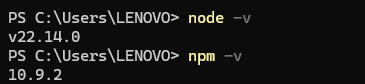

2. Buat direktori baru untuk proyek React Anda.

    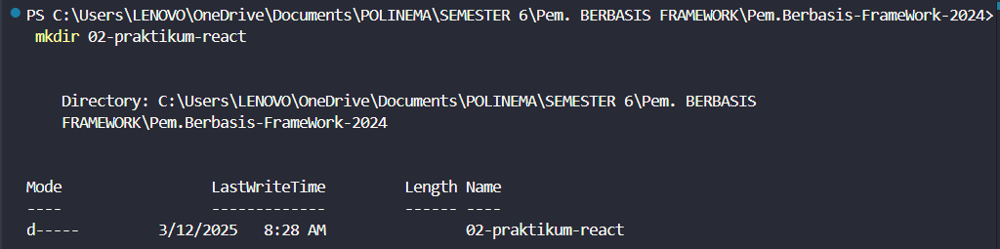

3. Inisialisasi proyek React.

    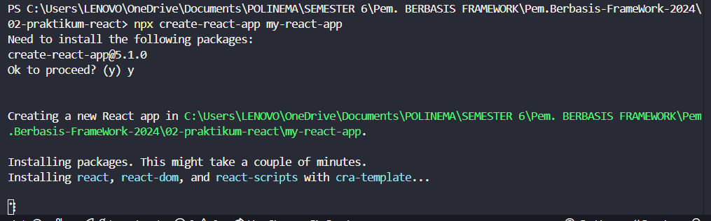

4. Jalankan aplikasi React.

    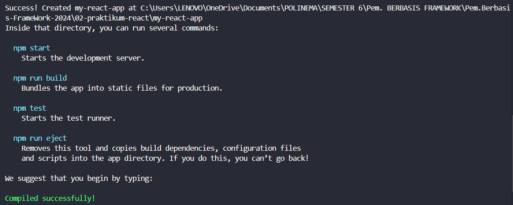

    Aplikasi akan terbuka di browser pada alamat http://localhost:3000.

    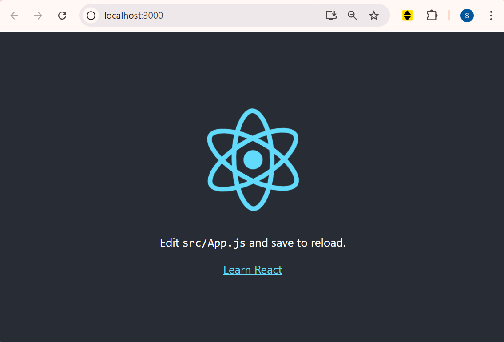

### **2. Membuat Komponen React**

1. Buka file src/App.js di text editor Anda. Ganti kode di dalamnya dengan kode berikut untuk membuat komponen sederhana.

    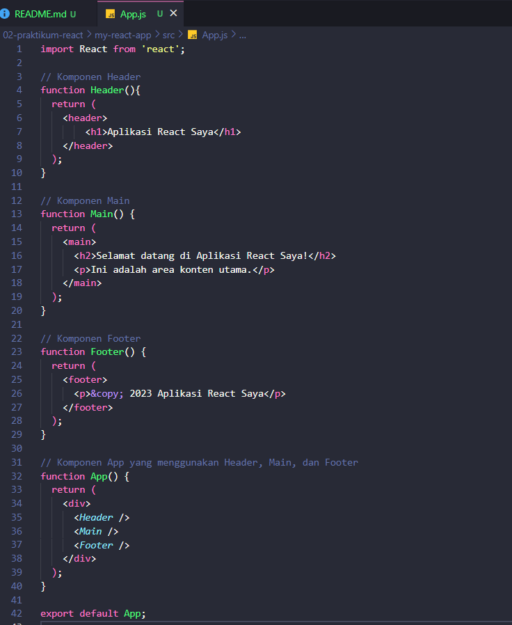

2. Simpan file dan lihat perubahan di browser. Anda akan melihat tampilan sederhana dengan header, konten utama, dan footer.

    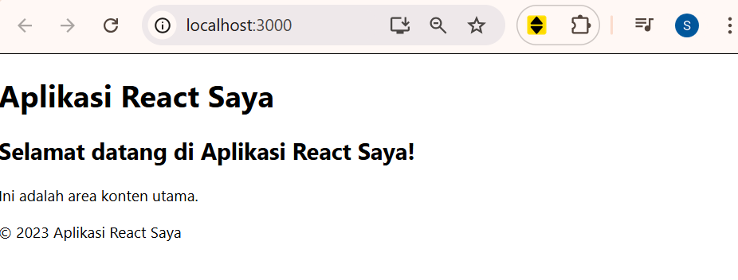

### **3. Menggunakan JSX untuk Membuat Komponen Dinamis**

1. Buat file baru di direktori src dengan nama Counter.js. 

2. Tambahkan kode berikut untuk membuat komponen Counter yang dinamis.

    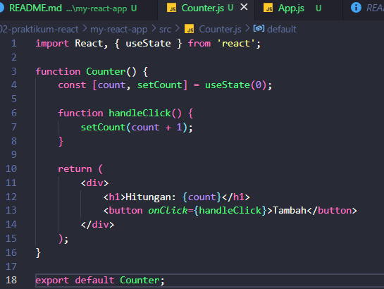

3. Buka file src/App.js dan impor komponen Counter

    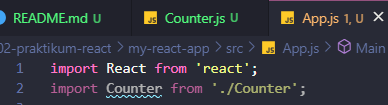

4. Tambahkan komponen Counter ke dalam komponen App

    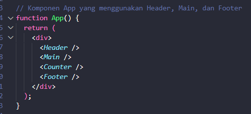

5. Simpan file dan lihat perubahan di browser. Anda akan melihat tombol "Tambah" yang dapat meningkatkan hitungan saat diklik.

    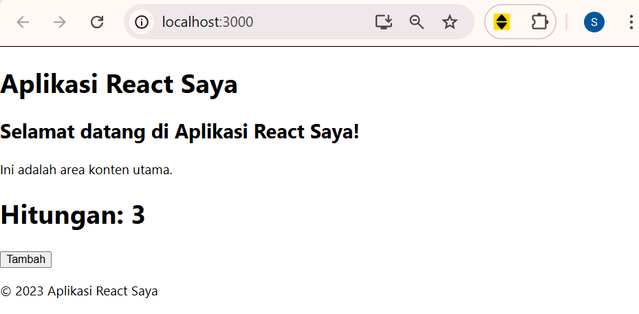

### **4. Menggunakan Props untuk Mengirim Data**

1. Buat file baru di direktori src dengan nama Greeting.js

2. Tambahkan kode berikut untuk membuat komponen Greeting yang menerima props

    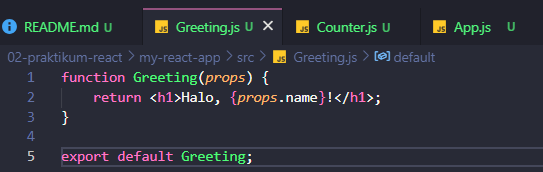

3. Buka file src/App.js dan impor komponen Greeting

    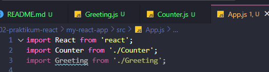

4. Tambahkan komponen Greeting ke dalam komponen App dan kirim props name

    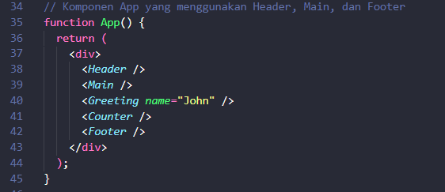

5. Simpan file dan lihat perubahan di browser. Anda akan melihat pesan "Halo, John!" yang ditampilkan oleh komponen Greeting.

    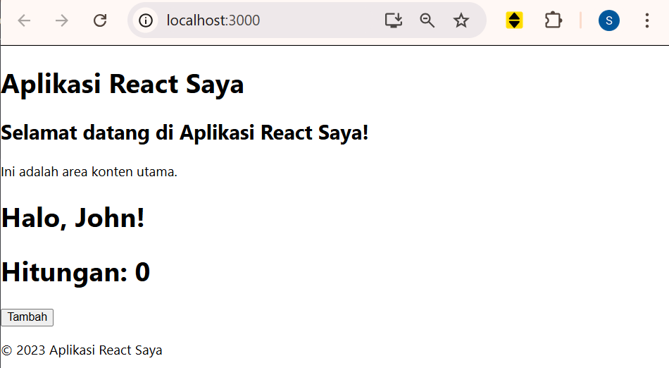

### **5.  Menggunakan State untuk Mengelola Data**

1. Buka file src/App.js dan tambahkan kode berikut untuk membuat komponen yang mengelola state

    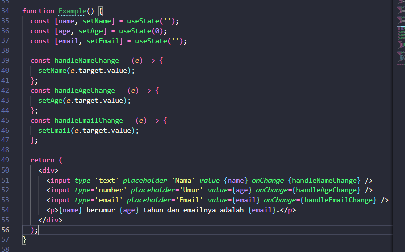


2. Tambahkan komponen Example ke dalam komponen App

    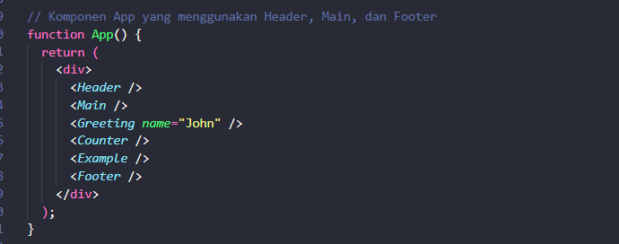

3. Simpan file dan lihat perubahan di browser. Anda akan melihat form input yang dapat mengupdate state dan menampilkan data yang dimasukkan

    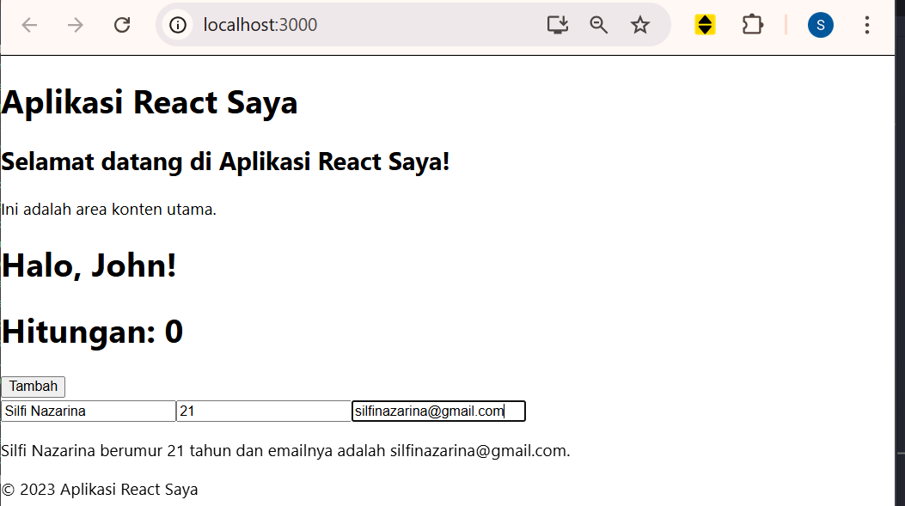

## **TUGAS**

1. Buat komponen baru bernama TodoList yang menampilkan daftar tugas (todo list). Gunakan
state untuk mengelola daftar tugas dan props untuk mengirim data tugas ke komponen anak.

2. Tambahkan fitur untuk menambahkan tugas baru ke dalam daftar menggunakan form input. 

3. Implementasikan fitur untuk menghapus tugas dari daftar. 

Jawab:

- ToDoList.js :

```js
    import React, { useState } from "react";

    const TodoItem = ({ task, index, toggleTask }) => {
    return (
        <div>
        <input 
            type="checkbox" 
            onChange={() => toggleTask(index)}
        />
        {task}
        </div>
    );
    };

    const TodoList = () => {
    const [tasks, setTasks] = useState([]);
    const [newTask, setNewTask] = useState("");

    const addTask = (e) => {
        e.preventDefault();
        if (newTask.trim() !== "") {
        setTasks([...tasks, { text: newTask, completed: false }]);
        setNewTask("");
        }
    };

    const toggleTask = (index) => {
        const updatedTasks = [...tasks];
        updatedTasks[index] = { 
        ...updatedTasks[index], 
        completed: !updatedTasks[index].completed 
        };
        setTasks(updatedTasks);
    };

    return (
        <div>
        <h2>Todo List</h2>
        <form onSubmit={addTask}>
            <input
            type="text"
            value={newTask}
            onChange={(e) => setNewTask(e.target.value)}
            />
            <button type="submit">Tambah Tugas</button>
        </form>
        <div>
            {tasks.map((task, index) => (
            <TodoItem key={index} index={index} task={task.text} toggleTask={toggleTask} />
            ))}
        </div>
        </div>
    );
    };

    export default TodoList;
```
- Penambahan komponen TodoList ke App.js:

    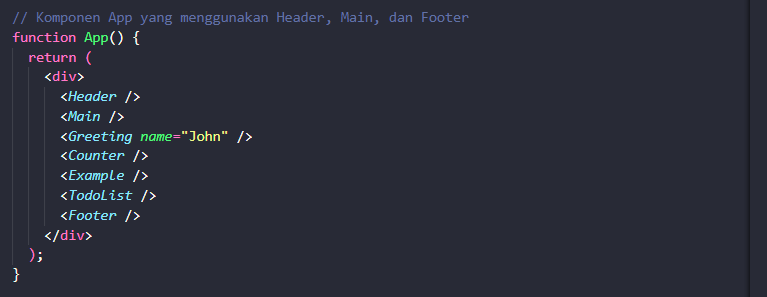

- Output: 

    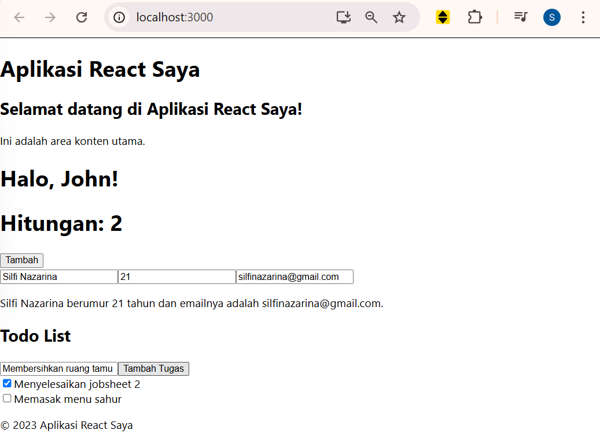