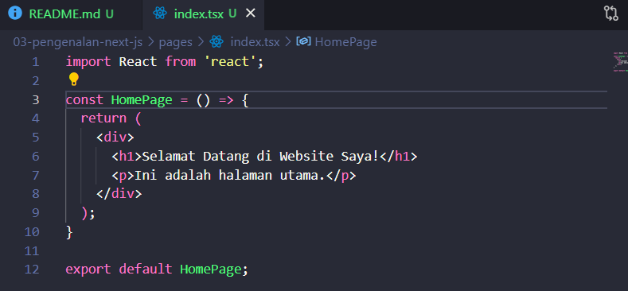
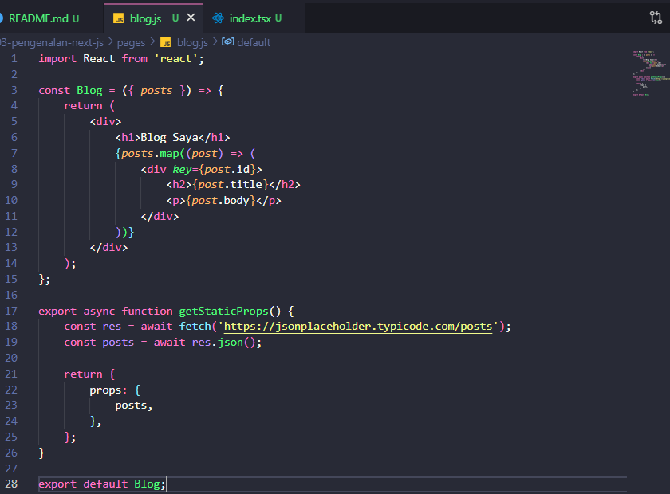

# SILFI NAZARINA / TI-3B / 2241720054 (21)

## **JOBSHEET 3 - PENGENALAN NEXT.JS**

### **1. Persiapan Lingkungan**

1. Pastikan Node.js dan npm sudah terinstal di komputer Anda

    

2. Buat direktori baru untuk proyek Next.js & Inisialisasi proyek Next.js. Perhatikan bahwa App Router belum digunakan.

    

3. Jalankan aplikasi Next.js

    

4. Aplikasi akan terbuka di browser pada alamat http://localhost:3000.

    

### **2. Membuat Halaman dengan Server-Side Rendering (SSR)**

1. Buka file pages/index.tsx

2. Ganti kode di dalamnya untuk membuat halaman sederhana

    

3. Simpan file dan lihat perubahan di browser. Anda akan melihat halaman utama dengan teks "Selamat Datang di Website Saya!"

    

### **3. Menggunakan Static Site Generation (SSG)**

1. Buat file baru di direktori pages dengan nama blog.js. Tambahkan kode berikut untuk membuat halaman blog dengan SSG

    

3. Simpan file dan buka http://localhost:3000/blog di browser. Anda akan melihat daftar post yang diambil dari API eksternal

    

### **4. Menggunakan Dynamic Routes**

1. Buat direktori baru di pages dengan nama blog. Buat file di dalam direktori blog dengan nama [slug].js. Tambahkan beberapa kode untuk membuat halaman dinamis berdasarkan slug

    

4. Simpan file dan buka http://localhost:3000/blog/contoh-post di browser. Anda akan melihat halaman yang menampilkan slug dari URL.

    

### **5. Menggunakan API Routes**

1. Pastikan terdapat direktori di pages dengan nama api. Buat file di dalam direktori api dengan nama products.js. Tambahkan untuk membuat API route yang mengembalikan daftar produk

    

3. Buat file baru di pages dengan nama products.js untuk menampilkan daftar produk

    

4. Simpan file dan buka http://localhost:3000/products di browser. Anda akan melihat daftar produk yang diambil dari API route. 

    

### **6. Menggunakan Link Component**

1. Buka file pages/index.tsx dan tambahkan modif kode untuk membuat link ke halaman lain

    

2. Buat file baru di pages dengan nama about.js untuk halaman "Tentang Kami"

    

3. Simpan file dan buka http://localhost:3000 di browser. Klik link "Tentang Kami" untuk navigasi ke halaman tentang. 

    

    

## **TUGAS**

1. Buat halaman baru dengan menggunakan Static Site Generation (SSG) yang menampilkan daftar pengguna dari API https://jsonplaceholder.typicode.com/users. 

- Membuat halaman users.js untuk menampilkan list users

    ```js
    // menampilkan list data users
    import Link from 'next/link';

    export default function UsersPage({ users }) {
        return (
        <div>
            <h1><strong>Daftar Pengguna</strong></h1>
            <br/>
            <ul>
            {users.map((user) => (
                <li key={user.id}>
                <Link href={`/users/${user.id}`}>{user.name}</Link>
                </li>
            ))}
            </ul>
        </div>
        );
    }

    export async function getStaticProps() {
        // Ambil data dari API JSONPlaceholder
        const res = await fetch('https://jsonplaceholder.typicode.com/users');
        const users = await res.json();

        return {
            props: {
            users, // Kirim data ke komponen sebagai props
            },
        };
    }
    ```

- Output;

    

2. Implementasikan Dynamic Routes untuk menampilkan detail pengguna berdasarkan ID. 

- Detail data user

    

- Membuat folder baru didalam pages bernama users yang berisi file [id].js sebagai dynamic routesnya untuk menampilkan data salah satu user

    ```js
    // menampilkan data salah satu user menggunakan dinamis route
    export async function getStaticPaths() {
        const res = await fetch('https://jsonplaceholder.typicode.com/users');
        const users = await res.json();

        const paths = users.map((user) => ({
            params: { id: user.id.toString() },
    }));

    return { paths, fallback: false };
    }

    export async function getStaticProps({ params }) {
        const res = await fetch(`https://jsonplaceholder.typicode.com/users/${params.id}`);
        const user = await res.json();

        return { props: { user } };
    }

    export default function UserDetail({ user }) {
        return (
            <div>
            <h3>{user.name} ({user.username})</h3>
            <br/>
            <p><strong>Username:</strong> {user.username}</p>
            <p><strong>Email:</strong> {user.email}</p>
            <br/>
            <h2><strong>Address</strong></h2>
            <p>{user.address.street}, {user.address.suite}</p>
            <p>{user.address.city}, {user.address.zipcode}</p>
            <br/>
            <p><strong>Phone:</strong> {user.phone}</p>
            <p><strong>Website:</strong> {user.website}</p>
            <br/>
            <h2><strong>Company</strong></h2>
            <p><strong>Name:</strong> {user.company.name}</p>
            <p><strong>Motto:</strong> {user.company.catchPhrase}</p>
            </div>
        );
    }
    ```

- Output:

    

3. Buat API route yang mengembalikan data cuaca dari API eksternal (misalnya, OpenWeatherMap) dan tampilkan data tersebut di halaman front-end.

- api/weather

    ```js
    export default async function handler(req, res) {
        const API_KEY = process.env.NEXT_PUBLIC_WEATHER_API_KEY;
        const city = req.query.city || "Malang";
    
        if (!API_KEY) return res.status(500).json({ error: "API Key tidak ditemukan" });
    
        try {
            const response = await fetch(`https://api.openweathermap.org/data/2.5/weather?q=${city}&appid=${API_KEY}&units=metric`);
            const data = await response.json();
            res.status(response.ok ? 200 : response.status).json(data);
        } catch {
            res.status(500).json({ error: "Terjadi kesalahan dalam mengambil data" });
        }
    }
    ```

- .env.local untuk menyimpan API_KEY

    ```
    NEXT_PUBLIC_WEATHER_API_KEY=fdea7c15510ed10953b1e713621a85c3
    ```

- pages/weather

    ```js
        import { useState } from "react";

        export default function WeatherPage() {
            const [city, setCity] = useState("");
            const [weather, setWeather] = useState(null);
            const [loading, setLoading] = useState(false);

            const fetchWeather = async () => {
                if (!city) return;
                setLoading(true);

                const response = await fetch(`/api/weather?city=${city}`);
                const data = await response.json();

                setWeather(data);
                setLoading(false);
            };

            return (
                <div>
                <h1><strong>Cek Cuaca</strong></h1>
                <br/>
                <input
                    type="text"
                    placeholder="Masukkan nama kota"
                    value={city}
                    onChange={(e) => setCity(e.target.value)}
                />
                <button onClick={fetchWeather} disabled={loading}>
                    {loading ? "Memuat..." : "Cari Cuaca"}
                </button>

                {weather && weather.main ? (
                    <div>
                    <br/>
                    <h2>Cuaca di <strong>{weather.name}</strong></h2>
                    <p><strong>Suhu:</strong> {weather.main.temp}°C</p>
                    <p><strong>Kecepatan Angin:</strong> {weather.wind.speed} m/s</p>
                    <p><strong>Kondisi:</strong> {weather.weather[0].description}</p>
                    </div>
                ) : (
                    weather?.error && <p style={{ color: "red" }}>Error: {weather.error}</p>
                )}
                </div>
            );
        }
    ```

- Output:

    


