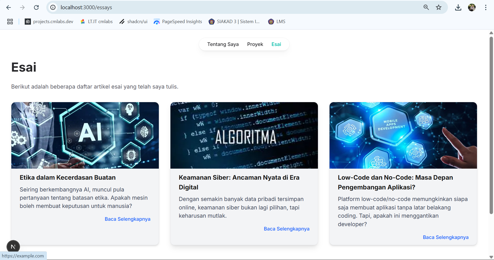

# **SILFI NAZARINA / TI-3B / 2241720054 (21)**

 <strong>JOBSHEET 5- Membangun Website Pribadi dengan Next.js (App Router), React, dan Tailwind CSS </strong>

1. Persiapan Lingkungan

Create dan jalankan aplikasi Next.js di http://localhost:3000/ 

2. Membuat Halaman Website

- Tentang Saya: Halaman berisi profil singkat dan link ke media sosial. http://localhost:3000/ untuk halaman "Tentang Saya". 

- Proyek: Halaman untuk menampilkan proyek-proyek yang telah diselesaikan. http://localhost:3000/projects untuk halaman "Proyek". 

- Esai: Halaman untuk menampilkan daftar artikel yang telah ditulis. http://localhost:3000/essays untuk halaman "Esai". 

3. Membuat Layout dan Navigasi

Menambahkan layout dan navigasi di setiap halaman 

4. Membuat Halaman Proyek dengan Grid Responsif

Halaman proyek akan menampilkan daftar proyek dalam bentuk grid yang responsif. 

## TUGAS

Eksplorasi Tailwindcss, kemudian. 

1. Modifikasi halaman "Esai" dengan Grid daftar artikel yang telah ditulis. 

2. Modifikasi halaman “Tentang Saya” Buat tampilan yang menarik 

