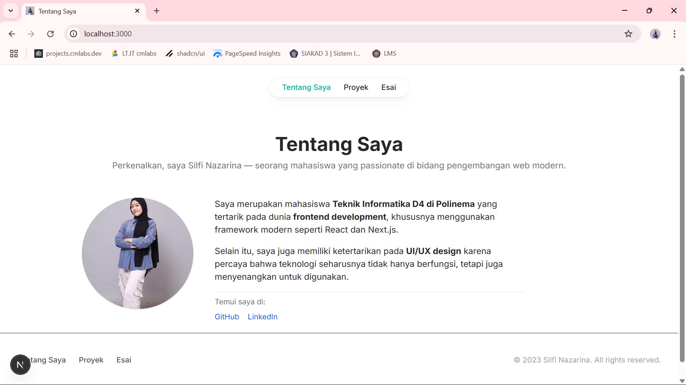
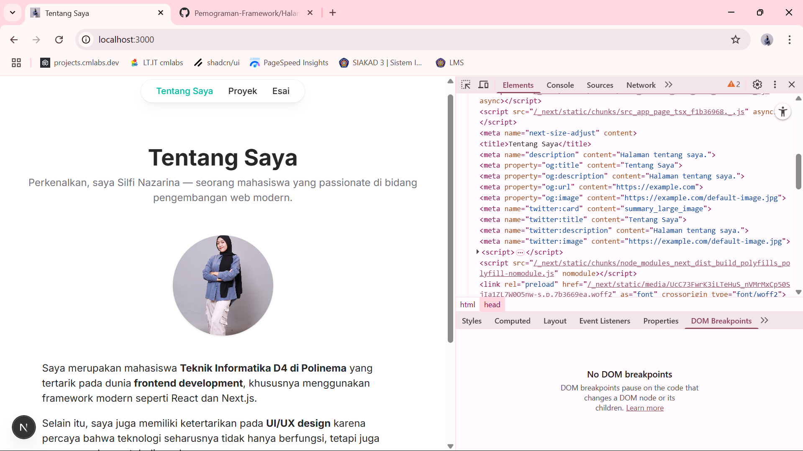
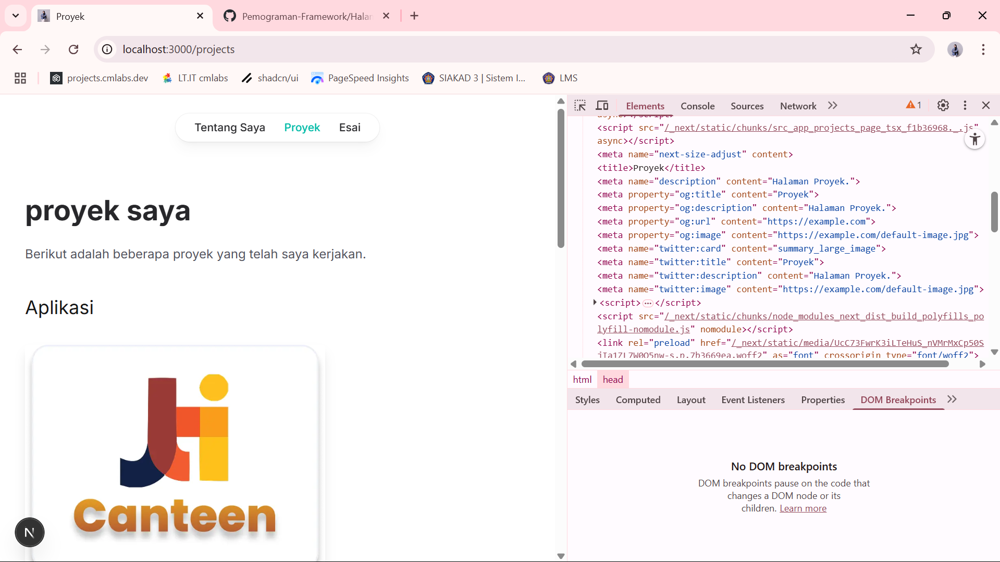
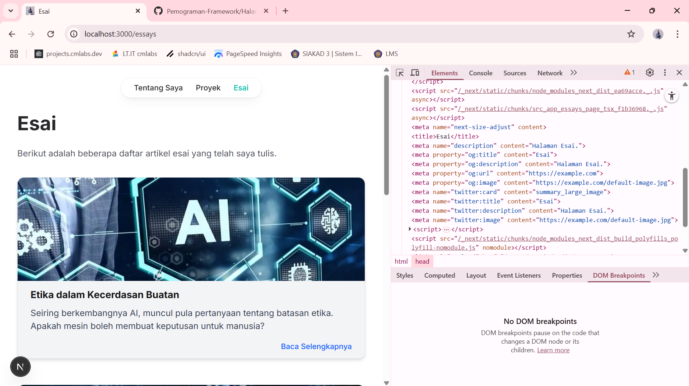
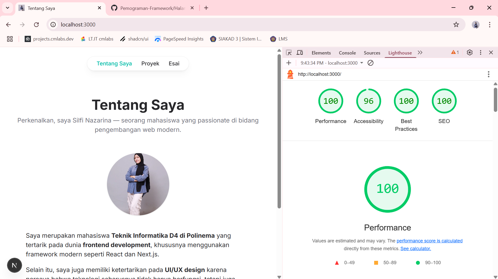
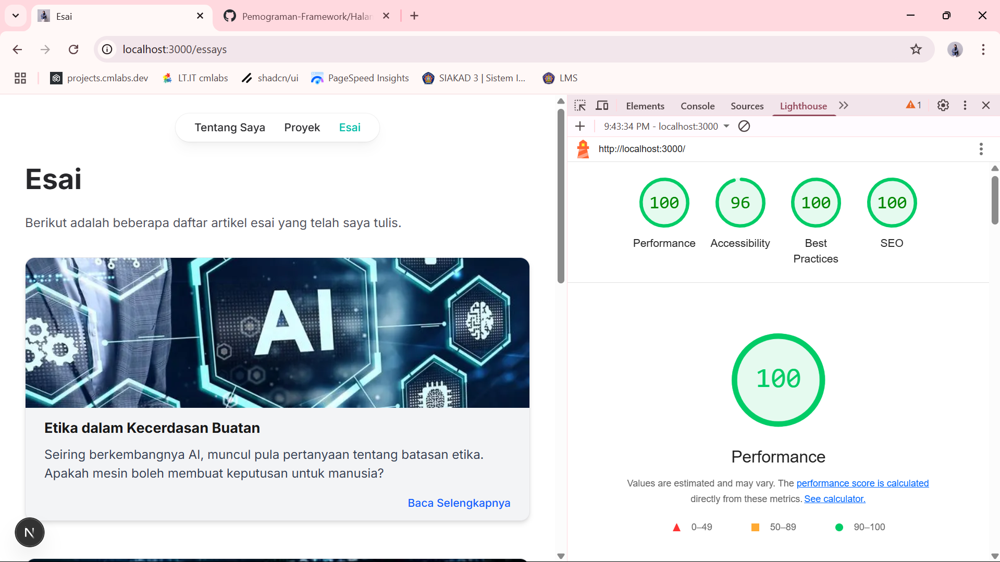
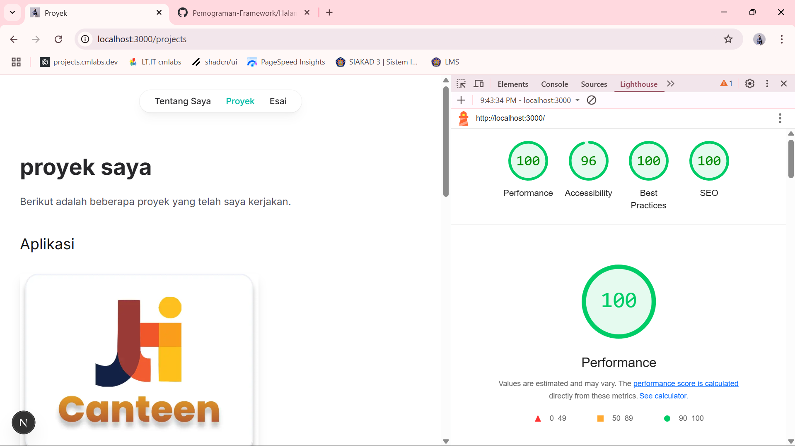

# **SILFI NAZARINA / TI-3B / 2241720054 (21)**

 <strong>JOBSHEET 10 - Membuat Halaman yang SEO-Friendly dengan Next.js</strong>

1. Menambahkan Favicon

    Create dan jalankan aplikasi Next.js di http://localhost:3000/ 

    

2. Menambahkan Metadata untuk SEO dan Open Graph Tags untuk Media Sosial

3. Menguji SEO

    
    
    

## TUGAS

Lakukan pengujian SEO dengan

1.	Gunakan tools seperti Google Search Console untuk memeriksa performa SEO dari suatu website.

    
    
    

